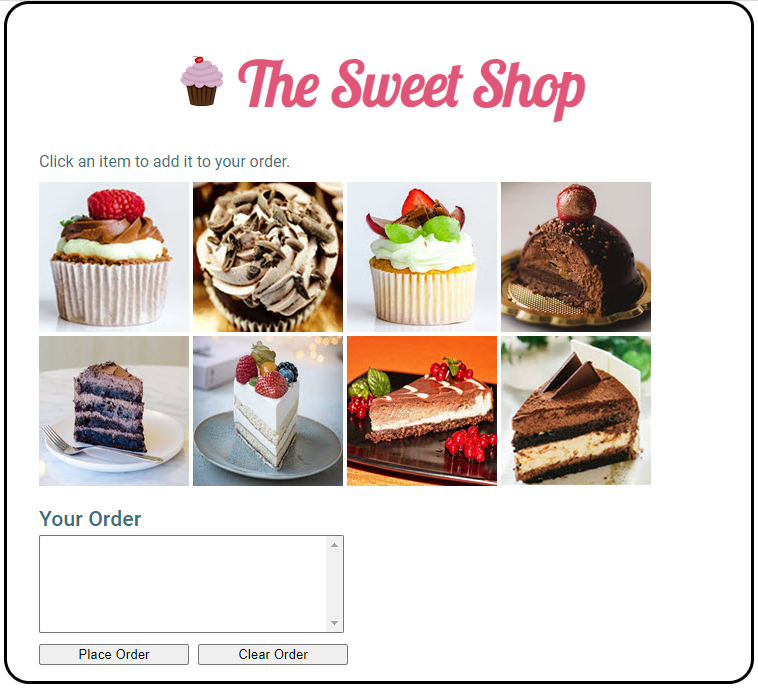
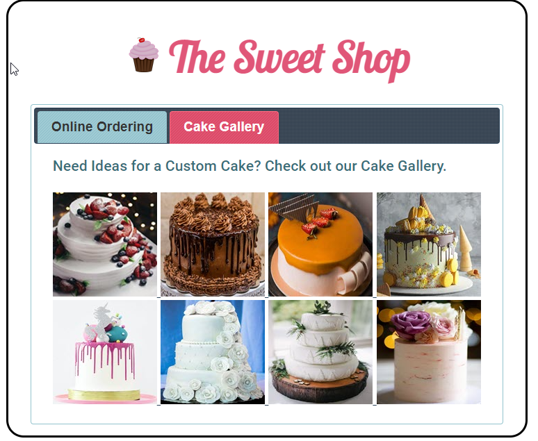
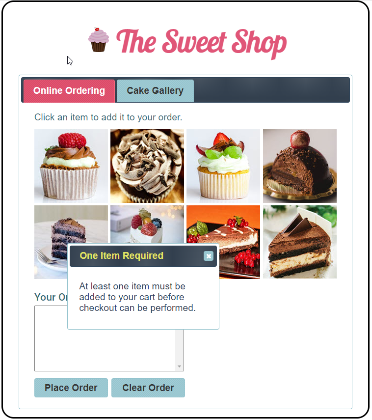
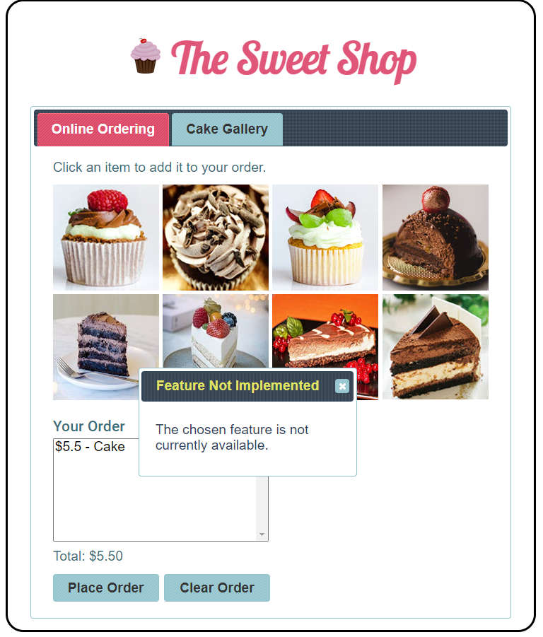

# W10A01-Bakery Revisited (Adding a jQuery Plugin and UI Widgets)

___

For this assignment, you will get an opportunity to add jQuery UI widgets, a jQuery UI theme, and a jQuery Plugin to an existing application.  None of the existing base functionality will be changed from the starting application.  It will just be enhanced an a Cake Gallery will be added.  Starting HTML, CSS and Javascript files, and supporting folder structures have been provided.  All may need to be updated depending on what you choose to do.  The goal of this assignment is to complete it

### Project Overview

___

When the Bakery application is rendered, it should resemble the following screen shot:

Your completed solution may look similar to the following screen shots (depending on what jQuery UI Theme you chose and which jQuery Plugin you elected to use for the Cake Gallery, there could be some differences in look and feel).

See video for the animation that I chose to finish the assignment with.  If you want to do the same type of animation, you are certainly free to do that.  You are also free to experiment and try out other options if you care to go that way on this assignment.

For this assignment, you must:

1. Select a jQuery UI Theme (either select an existing or create a custom theme), and select widgets to download.  Place relevant images in the images directory and the minified javascript and css files in the correct locations within the file solution and also in the index.html file. **Watch jQuery Accordion video for guidance.**

2. Add a jQuery UI Tab and place all the contents of the page in the first tab.  The second tab will be populated when the Cake Gallery content is added. Verify that the Tab is working before proceeding to next step.  **Watch jQuery Tab video for guidance.**

3. Replace the buttons with jQuery UI buttons.  You may add just the regular buttons.  Four points extra credit will be awarded if you add jQuery UI buttons with icons to the right of the text (you will need to use the online documentation on the jQuery UI site in order to accomplish this).  **Watch jQuery Button & Dialog video for guidance on adding a standard button.**

4. Add two dialogs to the page which should be used to replace the alert statements in the starting Javascript code.  **Watch jQuery Button & Dialog video for guidance on adding a dialog.**

5. Implement a Cake Gallery.  Small (150x150) images and large (400x400) images have been included in the images section.  Implement some type of picture gallery function utilizing a jQuery Plugin.  In this solution, I have implemented the Lightbox plugin.  You may use Lightbox as well.  However, four extra credit points are available if you choose and successfully implement a Gallery or Carousel that was not covered in the textbook or video.  Whichever plugin is implemented, the applicable css and js minified files need to be added to the project solution.  **Watch jQuery Lightbox video for guidance on implementing the Lightbox Plugin.**

6. Test your solution to ensure that all functionality that was initially provided in the application still works with the new jQuery UI widgets as well as your implemented Cake Gallery Plugin code.
   
### Grading Criteria
|Criteria| Total Points Assignment |
|--|--|
|  jQuery UI Theme, widgets, etc., were downloaded & implemented in Application as well as required jQuery UI css and javascript files. Any javascript or css requirements for the jQuery UI Theme or widgets should include only the minified versions of the libraries! | 10
| jQuery UI Tab control was added to the solution. Existing code was moved to tab 1 which was named Online Ordering. The second tab was named Cake Gallery.| 10
| The Place Order and Clear Order Buttons were upgraded to jQuery UI Buttons. | 6
| Extra Credit Opportunity for jQuery UI Icon Buttons: Four points extra credit will be awarded if each button, Place Order and Clear Order, is implemented with a reasonable icon which should appear to the left of the text. Do NOT implement the gear as shown on the jQuery site as the icons for these buttons! This has a zero point value and extra credit points will be awarded manually to not penalize  those who do not wish to do the extra credit.| 0
| Add a jQuery UI Dialog to replace the Empty Cart alert message in starter solution.
The dialog should contain a meaningful title and textual message indicating an Empty Cart situation. | 4
| Add a jQuery UI Dialog to replace the Not Implemented alert message in starter solution.
The dialog should contain a meaningful title and textual message indicating that the Feature is not Implemented. | 4
| Use a jQuery Plugin to implement the Cake Gallery. The can be implemented using the LightBox or a gallery or carousel that was not covered in class. The eight (150x150) and (400x400) should be utilized with whichever plugin option is selected to implement. Any javascript or css requirements for this plugin should include only the minified versions of the libraries! | 16
| Extra Credit Opportunity for jQuery Plugin not covered in class.  Four extra credit points are available if you choose and successfully implement a Gallery or Carousel that was not covered in the textbook or video walkthroughs. This has a zero point value and extra credit points will be awarded manually to not penalize  those who do not wish to do the extra credit. | 0
| Resulting solution is free of syntax and runtime errors. | 10

### Commit Changes to Remote GitHub Repository
___

1. Post your lab work to the remote GitHub repository after reviewing the Assignment Rubric in Eagle.